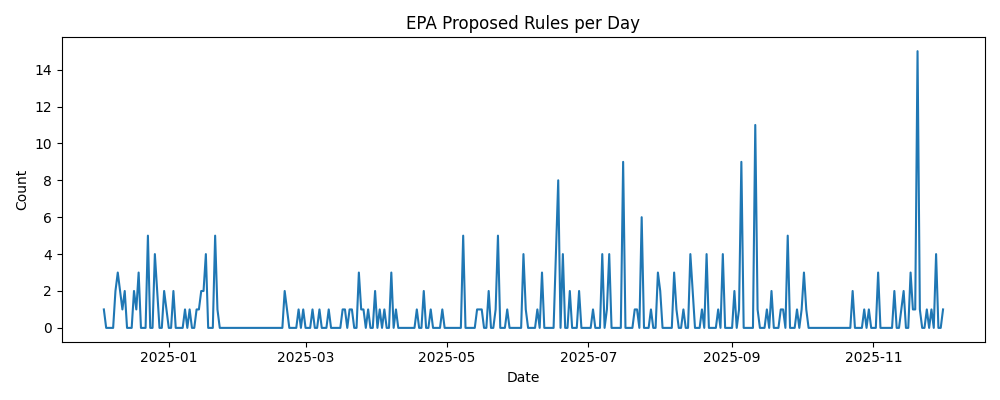

# EPA Proposed Rule Regulatory Monitoring Project


## 프로젝트 목표
- 미국 Federal Register(FR)에 게시된 환경보호청(Environmental Protection Agency, EPA)의 Proposed Rule(규제 제안) 데이터를 자동으로 수집 → 정제 → 품질 검증 → 시각화하는 파이프라인을 구축하여, 규제 변화 트렌드를 파악하는 것이 핵심 목표


## 프로젝트 선정 이유
- 규제 변화는 기업 리스크의 핵심 요인
- Final Rule에서 대응하면 이미 늦음
- Proposed Rule 단계가 기업의 전략적 대응이 가능한 마지막 시점
- 따라서 규제 변화 자동화 파이프라인을 구축하고자 함


## 디렉토리 구조
```
epa-regulation-monitor/
├── data/
│   ├── raw/              # Federal Register 원본 
│   │    └── epa_prorule_raw.csv
JSON/CSV
│   └── processed/        # 정제/표준화된 데이터
│        └── epa_prorule_normalized.csv
├── src/                  # 기능별 Python 코드
│   ├── fetch_epa.py      # API 데이터 수집
│   ├── normalize.py      # 스키마 정리 & 텍스트 정제
│   ├── qa.py             # 데이터 품질 검증(QA)
│   └── visualize.py      # 트렌드 분석 시각화
├── scripts/
│   └── run_pipeline.py   # 전체 파이프라인 자동 실행
├── reports/              
│   └── qa_report.md      # 품질 리포트(QA)
├── visuals/              # 그래프 시각화(트렌드 그래프)
│   ├── trend_daily.png         # 일간
│   ├── trend_daily_smooth.png  # 일간-7일 이동평균
│   ├── trend_weekly.png        # 주간
│   └── trend_monthly.png       # 월간
├── requirements.txt      # 필요한 패키지 목록
└── README.md             # 프로젝트 설명
```


## 단계 및 기능
1. 데이터 수집(fetch_epa.py)
- Federal Register API에서 다음 조건으로 자동 수집
- 기관: EPA
- 타입: Proposed Rule(PRORULE)
- 기간: 최근 365일
2. 정제/표준화(normalize.py)
- 컬럼 추가
- 필드명 통일
- 텍스트 전처리
3. 품질 검증(qa.py)
- 결측치 확인
- 중복치 확인
- 문자열 길이 확인
4. 시각화(visualize.py)
- 일별 트렌드(daily)
- 7일 이동 평균(7-day rolling avg)
- 주별 트렌드(weekly)
- 월별 트렌드(monthly)
5. 파이프라인(run_pipeline.py)
- 수집 -> 정제 -> QA -> 시각화 자동 완성


## 작동 순서
1. fetch_epa_proposed_rules() → 최근 365일 데이터 페이지네이션으로 수집
2. normalize(df_raw) → 날짜·문자열·리스트 필드를 표준 스키마에 맞게 변환
3. basic_qa(df_norm) → 결측치·중복·형식 오류 자동 점검
4. write_qa_markdown() → Markdown 리포트 생성
5. run_all_plots() → 전체 시각화 생성 및 visuals 저장


## 실행 방법
1. 가상환경 생성 (선택)
2. pip install -r requirements.txt
3. python scripts/run_pipeline.py 실행


## 주요 코드 요약
'''
while True:
    resp = requests.get(BASE_URL, params=params)
    results = resp.json().get("results", [])
    if not results:
        break
    all_results.extend(results)
    page += 1
'''
- Federal Register API는 한 요청에 최대 몇 개(약 100개)만 응답
- page를 사용한 반복 호출(pagination) 필요


## 시각화 인사이트



1. 일별로는 매우 불규칙하고 급등락이 반복되는 뭉텅이형 분포(busty pattern)
- 이동평균(rolling average)은 불규칙한 일일 변동을 안정적으로 정제해줌
2. 주별/월별로 보면 하반기에 발표량이 집중되는 구조적 패턴 존재
- 월별 분석은 규제 발표량의 구조적 패턴을 잘 보여줌 -> 장기적 모니터링에 특히 중요
3. 6월, 9월, 11월이 규제 활동의 주요 피크 시기
- 주별 시계열은 규제 활동 패턴을 예측하고 alerting system을 만들 때 유용함
- ex) EPA 발표량이 주 평균 대비 2배 증가 -> 사업 리스크 알림
- 미국 연방기관들을 회계연도(10월 시작) 전후로 규제 발표량이 변하는 경향 있음
4. 환경보호청(EPA)는 특정 기간에 묶음으로 규제 발표
- 규제 모니터링 알고리즘, 인공지능 기반 정책 예측, 기업 컴플라이언스 대응 일정 관리 등 기초 인사이트 제공


## 노션 참고
- https://www.notion.so/EPA-Proposed-Rule-Regulatory-Monitoring-Project-2bf46a80212380e392dbe07f4f474707?source=copy_link
